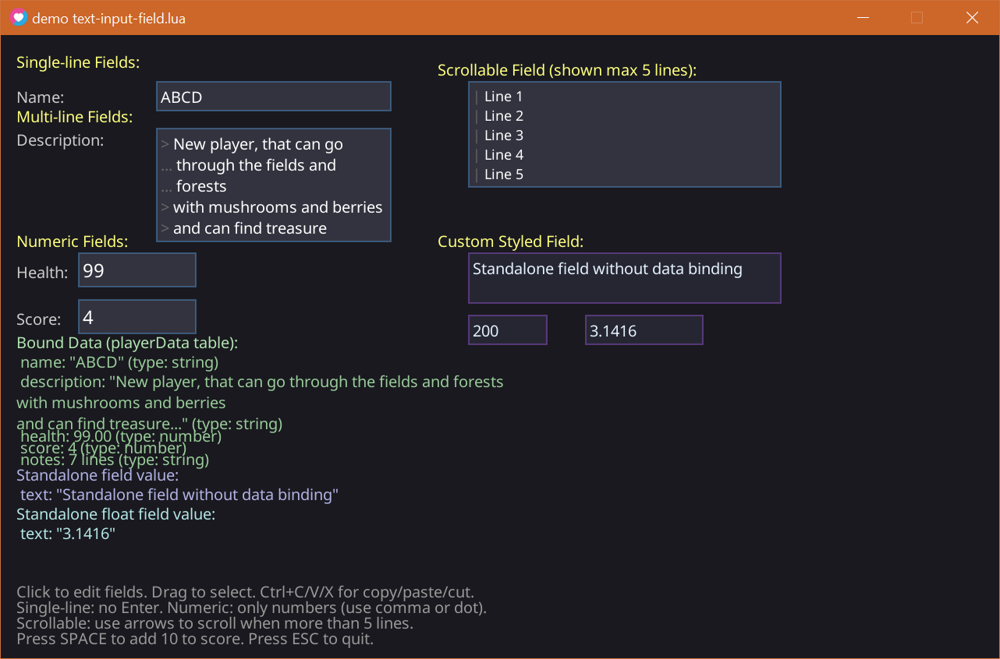

# text-input-field.lua

# Text Input Field Module for LÖVE





A comprehensive UTF-8 compatible text input field module for the LÖVE (Love2D) framework with support for multi-line editing, numeric validation, data binding, selection, wrapping, scrolling, callbacks and more.

## Features

- UTF-8 support
- Single-line and multi-line modes
- Word wrapping with custom indentation
- Numeric input validation (integer and float)
- Min/Max range validation
- Data binding to external tables
- Mouse selection (click and drag)
- Keyboard selection (Shift + arrows)
- Scrollable content with visible line limits
- Customizable colors and styling
- Hint text on hover
- Clipboard operations (Ctrl+C, Ctrl+V, Ctrl+X)
- Key repeat for navigation and deletion
- Smooth cursor blinking

## Installation

1. Download `text-input-field.lua`.
2. Place it in your project directory.
3. Require it in your code:

```lua
local TextInputField = require("text-input-field")
```

## Basic Usage

```lua
local field

function love.load()
    field = TextInputField:new({
        x = 100,
        y = 100,
        w = 300,
        text = "Hello World"
    })
end

function love.update(dt)
    local mx, my = love.mouse.getPosition()
    field:update(dt, mx, my)
end

function love.draw()
    field:draw()
end

function love.textinput(t)
    field:textinput(t)
end

function love.keypressed(key, scancode)
    field:keypressed(key, scancode)
end

function love.keyreleased(key, scancode)
    field:keyreleased(key, scancode)
end

function love.mousepressed(mx, my, button)
    field:mousepressed(mx, my, button)
end

function love.mousemoved(mx, my, dx, dy)
    field:mousemoved(mx, my, dx, dy)
end

function love.mousereleased(mx, my, button)
    field:mousereleased(mx, my, button)
end
```

## Configuration Options

### Basic Options

| Option | Type | Default | Description |
|--------|------|---------|-------------|
| `x` | number | 0 | X position |
| `y` | number | 0 | Y position |
| `w` | number | 200 | Width |
| `text` | string | "" | Initial text |
| `cursorPos` | number | 0 | Initial cursor position (0-based) |

### Visual Options

| Option | Type | Default | Description |
|--------|------|---------|-------------|
| `font` | Font | default | LÖVE font object |
| `minLines` | number | 1 | Minimum visible lines |
| `maxLines` | number | nil | Maximum visible lines (nil = unlimited) |
| `paddingX` | number | 5 | Horizontal padding |
| `paddingY` | number | 5 | Vertical padding |
| `bgColor` | table | {0.2, 0.2, 0.25} | Background color |
| `borderColor` | table | {0.3, 0.5, 0.7} | Border color |
| `textColor` | table | {1, 1, 1} | Text color |
| `cursorColor` | table | {1, 1, 1} | Cursor color |
| `blinkSpeed` | number | 3 | Cursor blink speed |

### Text Formatting

| Option | Type | Default | Description |
|--------|------|---------|-------------|
| `newLineIndent` | string | "" | Indent after newline |
| `wrapIndent` | string | " " | Indent for wrapped lines |

### Input Validation

| Option | Type | Default | Description |
|--------|------|---------|-------------|
| `singleLine` | boolean | false | Disallow newlines |
| `numeric` | string/boolean | nil | Numeric mode: `nil`, `true`, `"float"`, `"integer"` |
| `numericOnly` | boolean | false | Legacy: same as `numeric = true` |
| `min` | number | nil | Minimum allowed value |
| `max` | number | nil | Maximum allowed value |

### Data Binding

| Option | Type | Default | Description |
|--------|------|---------|-------------|
| `boundTable` | table | nil | Table to bind to |
| `boundKey` | string | nil | Key in table to bind to |

### Callbacks

| Option | Type | Default | Description |
|--------|------|---------|-------------|
| `onFocus` | function | nil | Called when field gains focus |
| `onBlur` | function | nil | Called when field loses focus |

### Hint Text

| Option | Type | Default | Description |
|--------|------|---------|-------------|
| `hintText` | string | nil | Tooltip text shown on hover |
| `hintDelay` | number | 2.0 | Seconds before hint appears |

## Methods

### Core Methods

```lua
field:update(dt, mx, my)
field:draw()
field:textinput(t)
field:keypressed(key, scancode)
field:keyreleased(key, scancode)
field:mousepressed(mx, my, button)
field:mousemoved(mx, my, dx, dy)
field:mousereleased(mx, my, button)
```

### Utility Methods

```lua
field:setActive(active)
field:clearSelection()
field:ensureCursorVisible()
field:updateBoundValue()
field:syncFromBoundValue()
field:getSelectionRange()
```

## Properties

### Read/Write

```lua
field.text
field.cursorPos
field.isActive
field.x, field.y
field.w, field.h
```

### Read-Only

```lua
field.selStart
field.selEnd
field.scrollLineOffset
```

## Keyboard Shortcuts

| Shortcut | Action |
|----------|--------|
| Arrow Keys | Move cursor |
| Shift + Arrow Keys | Extend selection |
| Home | Go to line start |
| End | Go to line end |
| Backspace | Delete previous character |
| Delete | Delete next character |
| Ctrl+A | Select all |
| Ctrl+C | Copy |
| Ctrl+V | Paste |
| Ctrl+X | Cut |
| Tab | Insert tab character |
| Enter | Insert newline (multi-line only) |

## Numeric Fields Behavior

### During Editing
- Partial numbers allowed: `"-"`, `"1."`, `"-3."`.
- Comma is converted to dot.
- Validation happens per keystroke.

### After Editing
- Text converts to number.
- Values are clamped to min/max.
- Integers are rounded.
- Floats retain decimals.
- Empty input becomes 0 or nil.

## Data Binding Details

- Field updates the table during editing.
- On blur, final numeric value is stored.
- External changes update the field when inactive.

## Hint Text

Hint appears when:
- Mouse hovers for specified delay.
- Field is inactive.
- `hintText` is set.

Hint hides when:
- Mouse moves
- Field becomes active
- Mouse leaves area

## Best Practices

- Always call `update(dt, mx, my)`.
- Avoid manually forcing sync.
- Use correct numeric type.
- Provide helpful hints.

## Troubleshooting

- Ensure all LÖVE callbacks call field methods.
- Numeric fields show strings while editing.
- Bound values update only when field loses focus.
- Mouse selection requires `mousemoved`.

## License

MIT License.

## Links

- GitHub: https://github.com/darkfrei/text-input-field
- LÖVE: https://love2d.org/

## Version

Current version: No version


